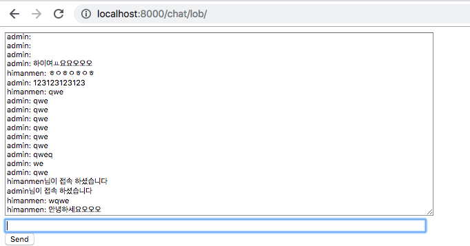
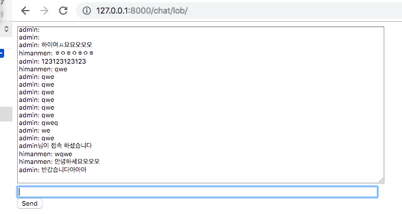
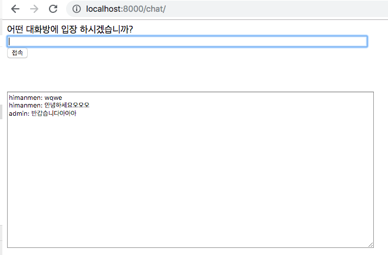
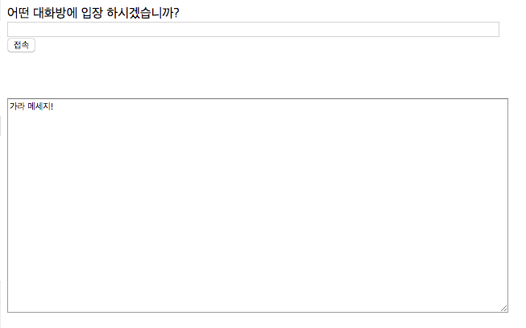
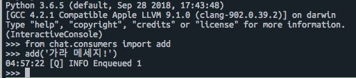

Django Channels을 이용한 채팅 및 django-qcluster 를 이용한 노티피케이션 기능

[출처1](https://antilibrary.org/1117)
[출처2](http://victorydntmd.tistory.com/261?category=703021)

# 채팅 화면

# 모든 채팅방의 메세지를 받는곳 & 노티를 받는곳

# 노티 날리기

